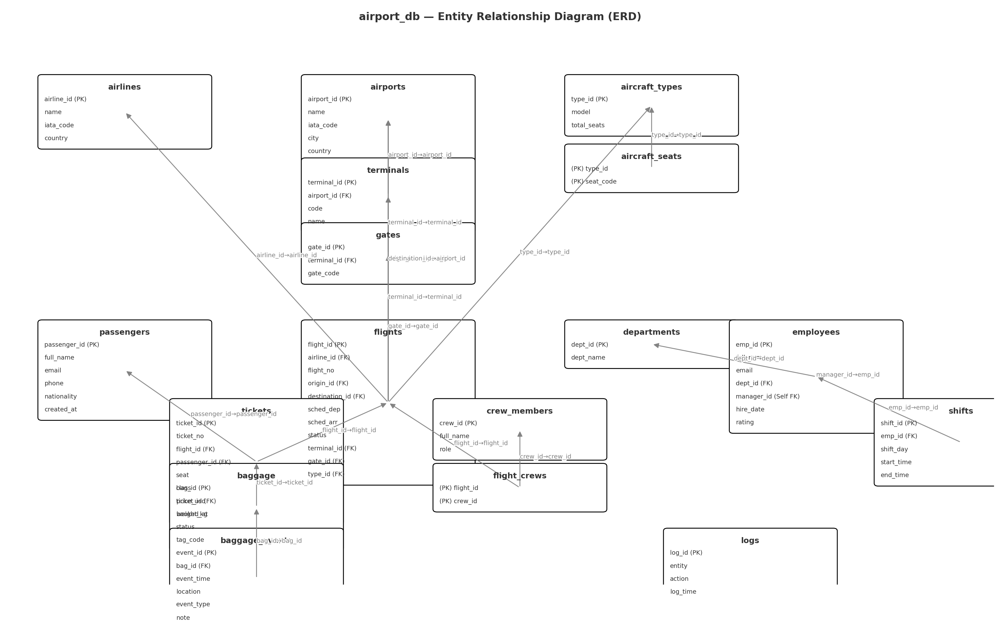

# Airport DB Management System

The **Airport DB** project is a complete database management system for airport operations using **MySQL**.  
It provides a structured database covering all core airport processes including flights, passengers, tickets, baggage, employees, and more.

## Project Contents
- **airport_db.sql**: Full SQL script to create the database, tables, relationships, views, triggers, and procedures.
- **airport_db_ERD.png** / **airport_db_ERD.pdf**: ERD diagram showing all tables and relationships.

## Features
- **Flight Management**: Airlines, destinations, flight status.
- **Passenger and Ticket Management**: Passenger details, ticket booking, pricing.
- **Baggage Management**: Track baggage from check-in to delivery.
- **Employee and Department Management**: Departments, employees, work shifts, and reporting hierarchy.
- **Reports**: Views for today's departures, airline sales, and passenger statistics.
- **Triggers & Procedures**: Automated logging and procedures for ticket booking and baggage check-in.

## ERD Diagram


## How to Run the Project

1. Open **MySQL Workbench**.
2. Execute the `airport_db.sql` script.
3. Verify the database setup:  
   ```sql
   USE airport_db;
   SHOW TABLES;
   ```

## Example Queries

### Today's Departures
```sql
SELECT * FROM today_departures_cai;
```

### Sales per Airline
```sql
SELECT * FROM sales_per_airline ORDER BY total_sales DESC;
```

## License
This project is licensed under the MIT License. You are free to use and modify it for educational or commercial purposes.

## Contributors
- [Your Name Here]
